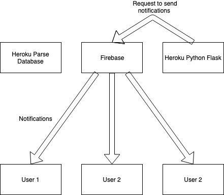

These are the files used for communicating between firebase our app and our parse server

This is the typical layout for our application we have our Heroku parse database that remembers information about current classes and users

When a user does something that should warrant a notification like any of the following actions:
- A user edits a class they are teaching
  - Users who are in the class should be notified when there had been an edits so they are aware of what to do
  - The user should get a notification to make sure that the edits have been recorded

- A user sends a message in the in class messaging system
  - All users should get a notification of what this user said to promote communication

- A user follows another user
  - The target user should get a notification that someone has followed them

Whenever a user causes something that should warrant a notification like the ones above the user sends a request to our Heroku python script:

The python script is using flask to recognize post requests and communicated with another python script to collect data from the main parse database. We read the request of the user and collect information from the parse server. For example if a user edits a class the pythons script collects the uses it should notify form the database.

Once the python script has collected the users tokens and targets for notifications it sends multiple requests to firebase for it to send notifications to specific users with specialized messages for each one.

